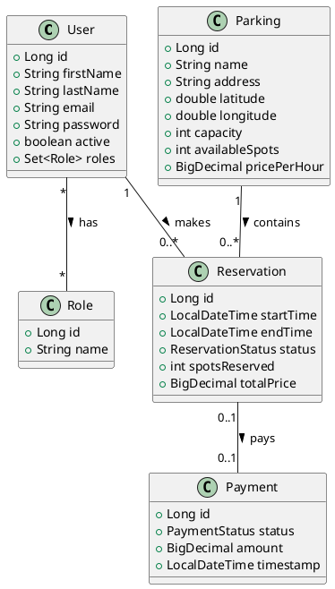
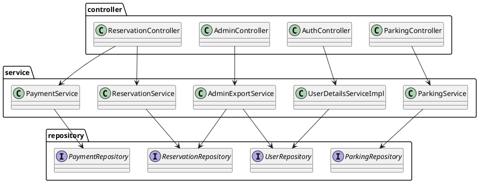

# Diagrammes de classes — Parking Location

Objectif : fournir un jeu de diagrammes de classes UML (PlantUML) et une documentation rapide des relations principales entre les classes du projet « Parking Location ». Ce document est en français et vise à aider le développement, la maintenance et la lecture du code.

Checklist
- [x] Identifier les classes métier et leurs attributs principaux
- [x] Fournir un diagramme de classes domaine (modèles : User, Parking, Reservation, Payment, Role)
- [x] Fournir un diagramme d'architecture montrant controllers/services/repositories
- [x] Lister les fichiers Java principaux associés à chaque classe
- [x] Inclure code PlantUML pour rendu automatique

Remarques
- Les diagrammes sont fournis en PlantUML afin que vous puissiez les rendre localement (via plugin IDE, site PlantUML ou docker/plantuml).
- Les attributs listés sont résumés à partir du code source (attributs clés) — pour les détails exacts, consultez les classes Java correspondantes.

---

## 1) Diagramme de classes — Modèle (domaine)

PlantUML (copiez ce bloc dans un fichier `.puml` ou utilisez un plugin) :



Explication succincte :
- Un `User` peut effectuer plusieurs `Reservation`.
- Une `Reservation` concerne un `Parking` et peut avoir un `Payment` associé.
- Les `Role` sont attachés aux utilisateurs (ex : ADMIN, USER).

---

## 2) Diagramme d'architecture — couches (Controller / Service / Repository)

PlantUML :



Explication :
- Les controllers exposent les endpoints REST et délèguent la logique métier aux services.
- Les services utilisent les repositories (Spring Data JPA) pour accéder à la base.

---

## 3) Mapping fichier -> classes principales

Dossier source : `src/main/java/com/parking/location`

- Modèles (domain) :
  - `model/User.java` (classe `User`)
  - `model/Role.java` (classe `Role`)
  - `model/Parking.java` (classe `Parking`)
  - `model/Reservation.java` (classe `Reservation`)
  - `model/Payment.java` (classe `Payment`)
  - `model/ReservationStatus.java`, `model/PaymentStatus.java` (énums)

- DTOs :
  - `dto/*` (ex: `SignupRequest`, `LoginRequest`, `ParkingNearbyResponse`, `ReservationRequest`, etc.)

- Repositories :
  - `repository/UserRepository.java`
  - `repository/ParkingRepository.java`
  - `repository/ReservationRepository.java`
  - `repository/PaymentRepository.java`

- Services :
  - `service/ParkingService.java`
  - `service/ReservationService.java`
  - `service/PaymentService.java`
  - `service/AdminExportService.java`
  - `security/UserDetailsServiceImpl.java`

- Controllers :
  - `controller/AuthController.java`
  - `controller/ParkingController.java`
  - `controller/ReservationController.java`
  - `controller/AdminController.java`

- Sécurité / utilitaires :
  - `security/SecurityConfig.java`
  - `security/JwtUtils.java`
  - `security/AuthTokenFilter.java`

---

## 4) Instructions pour générer les images UML

1) Utiliser un plugin PlantUML dans votre IDE (IntelliJ, VSCode) : collez le bloc PlantUML ci-dessus et générez l'image.
2) Utiliser le site PlantUML : https://www.plantuml.com/plantuml
3) Générer localement via docker :

```powershell
# depuis PowerShell (windows)
# placez le texte PlantUML dans fichier diagram.puml
docker run --rm -v ${PWD}:/workspace plantuml/plantuml -tpng /workspace/diagram.puml
```

ou via jar :

```powershell
java -jar plantuml.jar diagram.puml
```

---

## 5) Notes d'adaptation
- Les attributs listés sont des résumés utiles pour la lecture et peuvent omettre des annotations JPA (ex: @ManyToOne, @OneToMany). Consultez les fichiers sources pour les détails d'API et d'annotations.
- Si vous souhaitez que je génère un diagramme plus complet (avec méthodes publiques, annotations JPA, cardinalités exactes ou un diagramme pour chaque package), dites-moi le niveau de détail souhaité.

---

Fin du document — généré automatiquement.

